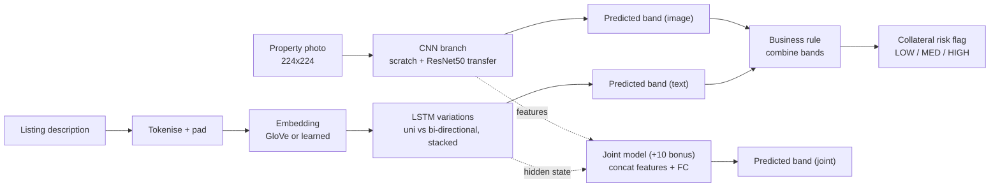

# Mortgage Collateral Risk Deep-Learning Assistant

> This is the implementation plan that was agreed before work started.
> It is kept here so that future sessions (on any machine) have full context.

## Business framing
A mortgage underwriter or P2P-lending platform receives a property listing (photo + description) as collateral for a loan. The pipeline outputs:

- **CNN** — predicts a property value / condition tier from the frontal photo.
- **RNN/LSTM** — predicts a value / quality tier from the listing description.
- **Business rule** — combines both into a `collateral_risk_flag` (LOW / MEDIUM / HIGH) driving the underwriting decision (auto-approve / secondary review / manual appraisal). This is the credit-risk continuation of the previous `loan_grade` project — same ordinal-band framing, now from unstructured image+text data.
- **Joint model (+10 bonus)** — single network consuming image + description that predicts the price band end-to-end, benchmarked against each unimodal model.

End user: mortgage underwriter / risk officer. FP cost = unnecessary manual appraisal; FN cost = over-lending on bad collateral. Ethics: location/neighbourhood bias in both photos and descriptions must be discussed explicitly.

## Dataset strategy

The project brief allows two datasets in the same domain that do **not** share samples for the unimodal tasks, but the bonus joint model requires one dataset with paired `image + text + shared label` samples. Strategy: pick one paired dataset that covers all three needs.

Primary candidates:

- **Kaggle "House Prices and Images - SoCal"** (Ahmed & Moustafa, ~15k frontal images + price + minor tabular fields). Strong for CNN + joint model, but description fields may be too short for the RNN 15-word minimum.
- **Kaggle "Real Estate Data London 2024"** or **Airbnb Open Data (NYC)** — rich listing descriptions with price, meeting the ≥15-word RNN requirement.

Adopted approach: SoCal for the CNN branch, London/Airbnb text for the RNN branch, and a constructed paired subset (by price band) for the joint model.

Target variable: 5 ordinal **price bands** (Budget, Economy, Mid-Range, Premium, Luxury) derived from quantiles of the listed price. Mirrors the `loan_grade` A→G target from the previous credit-risk project.

## Architecture

- **CNN**: (a) from-scratch 4-conv-block net, (b) transfer learning with ResNet-50 (ImageNet weights, freeze backbone then fine-tune `layer3` + `layer4` + fc). Augmentation: random flip, rotation ±10°, colour jitter. Metrics: Accuracy, macro-F1, confusion matrix, training curves.
- **RNN**: (a) single-layer LSTM + learned 128-d embedding, (b) bidirectional 2-layer LSTM + pretrained GloVe-100d + dropout 0.4. Tokenisation: word-level with unk handling, `MAX_SEQ_LEN` chosen at 95th percentile. Same metrics as CNN.
- **Joint model**: CNN penultimate features (2048-d from ResNet-50 GAP) concatenated with the final LSTM hidden state (256-d bidirectional) → 2 FC layers + softmax. Trained on a paired subset with both backbones frozen.

## Business integration logic

Let `b_img`, `b_txt` be predicted band ranks (0=Budget … 4=Luxury) and `b_listed` the applicant's claimed band.

- If both `b_img` and `b_txt` are **≥2 bands below** `b_listed` → `HIGH` (manual appraisal).
- If exactly one is ≥2 bands below → `MEDIUM` (secondary review).
- Otherwise → `LOW` (auto-proceed).

Report a side-by-side table of 20 test examples with CNN/RNN predictions, ground truth, and combined flag. Required comparison chart: CNN macro-F1 vs RNN macro-F1 vs combined-rule F1 vs joint-model macro-F1.

## Deployment

Streamlit app (`app.py`) with three panels:

1. Image uploader → CNN prediction + confidence.
2. Text box → RNN prediction + confidence.
3. Combined recommendation card (`LOW/MED/HIGH` + short rationale).

Target host: **Hugging Face Spaces** (free tier handles ResNet-50 + small LSTM). Include a screen recording in the submission.

## Notebook structure (matches grading rubric §5.1–5.8)

1. Setup, reproducibility, imports
2. Business problem & data sources
3. EDA — images (sample grid, dims, class bar) and text (length histogram, top terms, per-class samples)
4. Preprocessing pipelines (image + text)
5. Stratified 70/15/15 splits, seed 42, test set locked
6. CNN — scratch vs transfer, curves, test metrics, discussion
7. RNN — two variations, curves, test metrics, discussion
8. Business integration — rule, 20-example table, comparison chart
9. Joint model (+10 bonus) — architecture, training, comparison vs unimodal
10. Explainability — Grad-CAM + attention/SHAP
11. Deployment — link, screenshots, inference code
12. Business framing, ethics (location/appearance bias), limitations
13. Contribution table (solo), references

## Key risks and mitigations

- **Text length**: SoCal descriptions may be <15 words avg. Mitigation: use a separate real-estate text dataset (Airbnb/London) for the RNN branch.
- **Class imbalance across price bands**: stratified sampling + `WeightedRandomSampler`.
- **Joint-model overfitting** (paired sample count smaller than unimodal): strong dropout, freeze both backbones, early stopping on validation macro-F1.
- **Deployment memory on HF Spaces free tier**: if ResNet-50 too heavy, fall back to MobileNet-V3 for the deployed artefact.

## Solo timeline (rough, 5–6 weeks)

- **Week 1** — dataset scouting, confirm paired dataset, EDA, preprocessing.
- **Week 2** — CNN scratch + transfer learning, training curves, test metrics.
- **Week 3** — RNN two variations, decide on embeddings, test metrics.
- **Week 4** — Business integration rule + joint model.
- **Week 5** — Explainability, Streamlit prototype, HF Spaces deploy.
- **Week 6** — PDF export, presentation deck, presentation recording (fallback if absent).
